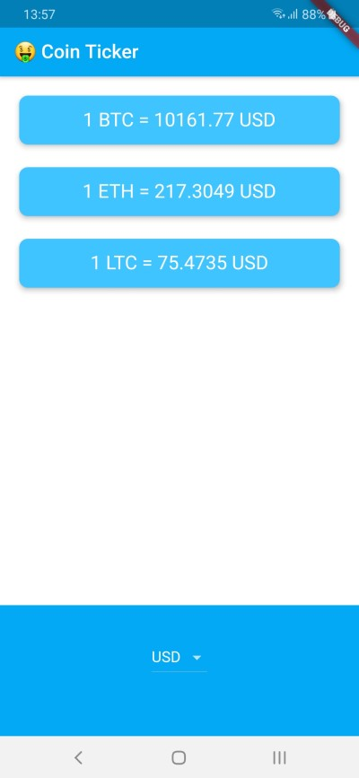
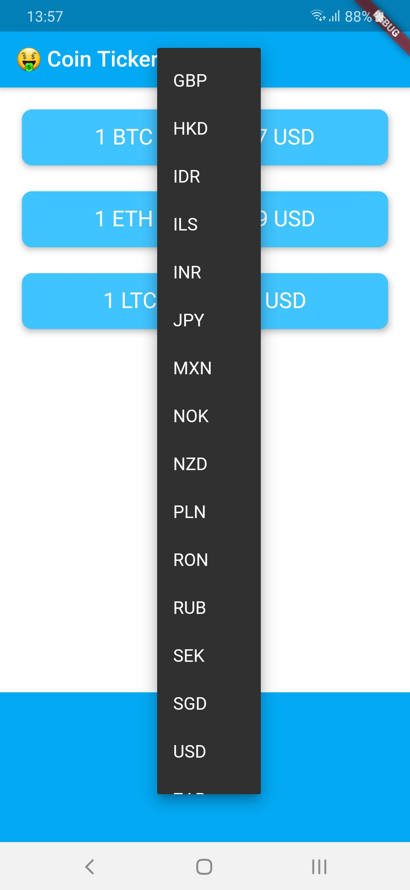
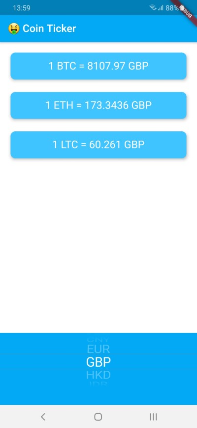

# Bitcoin Ticker

It's a cryptocurrency app that shows live price of crypto coins such as BTC, ETH and LTC in many global currencies.

### It renders the UI components based on the platform that the app is running on.

## Screenshots
### Android DropdownButton:


### IOS CupertinoPicker:


## Preparing Dependencies

Use :

```bash
flutter pub get
```
To install all the dependencies in the pubspec.yaml file.

## Runing The App

```bash
flutter run
```
